<div align="center">

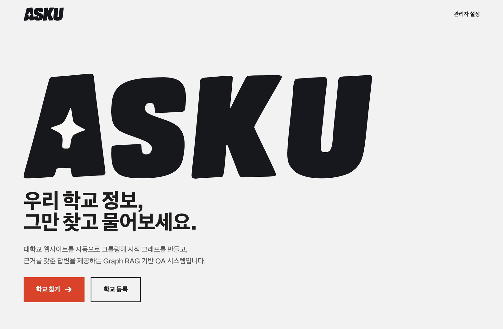

# 대학 웹사이트 자동 QA 시스템

**공지 URL 하나만 주면, 그 학교 전용 질의응답 시스템이 자동으로 만들어진다.**

[**🌐 서비스 바로가기**](https://linklingj.github.io/ASKU/) 
[기획 문서](docs/00_BASICS/PLAN.md) · [시스템 설계](docs/01_SYSTEM) · [배포 가이드](docs/02_FEATURES/deployment.md)

<br>

       


</div>

---

## 목차

- [요약](#요약)
- [왜 만들었나](#왜-만들었나)
- [왜 Graph RAG인가](#왜-graph-rag인가)
- [주요 기능](#주요-기능)
- [화면](#화면)
- [아키텍처](#아키텍처)
- [실행 방법](#실행-방법)
- [프로젝트 구조](#프로젝트-구조)
- [기술적 도전과 해결](#기술적-도전과-해결)
- [문서](#문서)
- [팀](#팀)

---

## 요약


ASKU는 **학교마다 만들던 대학 챗봇을, URL 한 줄로 자동 생성되는 파이프라인으로 바꾼 시스템**이다.

대학 공지 게시판 URL 하나를 입력하면, 크롤링 → 엔티티·관계 추출 → 지식그래프 구축까지 자동으로 끝나고,
학생은 학교 정보를 자연어로 물으면 원문 링크가 붙은 답을 받는다.

- **입력** — 학교명 + 공지 게시판 URL. (선택) 수강편람, 학칙 같은 PDF 문서 첨부.
- **지식 그래프 생성** — 하위 게시판 자동 발견 → robots.txt를 지키며 목록·상세 수집 → 청킹 → LLM으로 `부서`·`담당자` 등 엔티티와 관계 추출 → bge-m3 임베딩 → **지식그래프** 적재.
- **질의** — 자연어 질문 → 벡터 top-k 검색 + 질문 엔티티의 1-hop 이웃 확장 → 답변 생성 → **근거가 된 공지 원문 링크를 함께 반환.** 근거가 없으면 지어내지 않고 보류한다.
- **유지** — 스케줄러가 주기적으로 재크롤링하고, 해시 비교로 **바뀐 문서만** 갱신한다. 사라진 공지는 만료 처리.

현재 **11개 대학**이 수집 검증을 통과했고, 그중 3곳은 **코드를 한 줄도 추가하지 않고** 붙었다.

---

## 왜 만들었나

> "관심과목 담기 마감이 언제였지?" — 이 한 줄을 확인하려고 학교 홈페이지에서 게시판 5개를 뒤진다.

<table>
<tr>
<td width="50%" valign="top">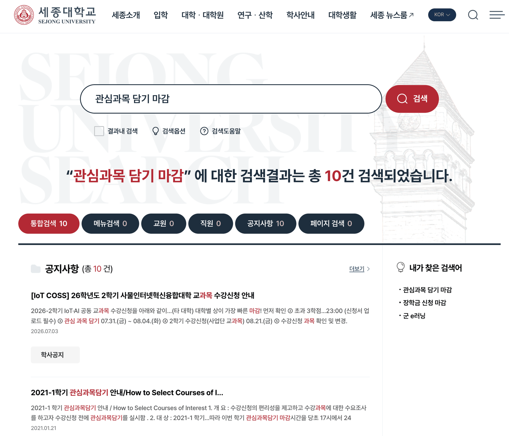</td>
<td width="50%" valign="top">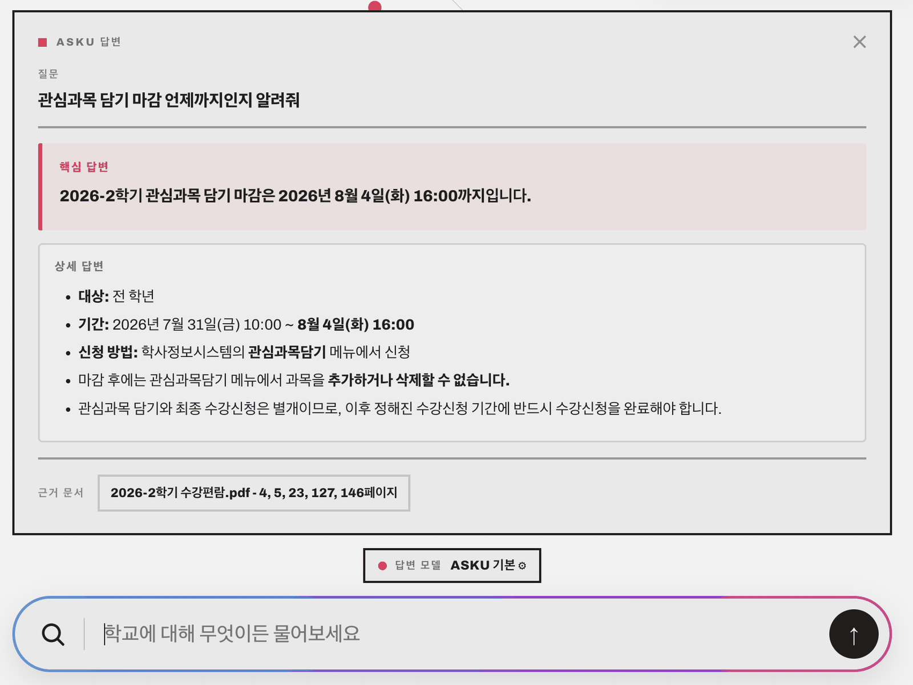</td>
</tr>
<tr>
<td valign="top"><b>학교 공식 통합검색</b> — 10건이 나오지만 대부분 다른 학기·다른 학과 공지다. 정작 필요한 날짜는 2021년 글과 섞여 있고, 직접 열어 확인해야 한다.</td>
<td valign="top"><b>ASKU</b> — <b>2026년 8월 4일(화) 16:00</b>. 대상·기간·신청 방법까지 정리해 주고, 근거로 쓴 <code>2026-2학기 수강편람.pdf</code>의 <b>페이지 번호</b>까지 붙는다.</td>
</tr>
</table>

대학 정보는 **없어서** 못 찾는 게 아니라 **흩어져 있어서** 못 찾는다. 공지사항·학사공지·장학공지·국제처가 각각 다른 게시판에 있고, 검색 기능은 제목 일치만 걸리며, 진짜 필요한 정보는 첨부된 PDF 안에 있다.

기존 대학 챗봇은 대부분 **학교마다 사람이 직접 데이터를 넣어 만든다.** 그래서 한 학교용으로 만들면 다른 학교에 못 쓰고, 공지가 바뀌면 사람이 다시 넣어야 한다.

**ASKU는 이 과정을 통째로 자동화한다.**

| | 기존 방식 | ASKU |
|---|---|---|
| 새 학교 추가 | 학교별 파서·데이터 수작업 | **공지 URL 입력 한 번** |
| 정보 갱신 | 사람이 다시 입력 | **스케줄러 자동 재크롤링** |
| 관계형 질문 | 키워드 검색이라 불가 | **지식그래프 1-hop 확장** |
| 답변 신뢰도 | 출처 없음 / 환각 | **원문 링크 인용, 근거 없으면 답변 보류** |
| PDF 안의 정보 | 검색 불가 | **문서 업로드 → 2단 RAG fallback** |

---

## 왜 Graph RAG인가?

일반 벡터 RAG는 **질문과 비슷한 문단을 찾아오는** 방식이다. 대학 공지에서는 이게 자주 무너진다.

> **"성적우수장학금 담당 부서 전화번호 알려줘"**

이 질문의 답은 **한 문서 안에 없다.** 장학금 정보는 「2026 교내 장학금 안내」에 있고, 담당 부서 연락처는 「학생지원팀 업무 안내」에 있다. 벡터 검색은 "성적우수장학금"과 비슷한 문단만 가져오므로 **전화번호는 컨텍스트에 아예 들어오지 못하고**, LLM은 없는 번호를 지어내거나 모른다고 답한다.

ASKU는 공지를 문단 뭉치가 아니라 **엔티티와 관계의 그래프**로 저장한다.

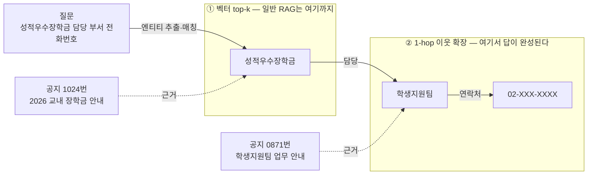

질문에서 `성적우수장학금`을 뽑아 그래프의 해당 노드를 찾고, **1-hop 이웃**을 따라가면 `학생지원팀 → 전화번호`가 컨텍스트에 자동으로 딸려 온다. 두 문서를 이어붙이는 일을 검색이 대신 해 준다.

### 일반 RAG 대비 장점

| | 일반 벡터 RAG | **ASKU의 Graph RAG** |
|---|---|---|
| **관계형 질문** | 답이 여러 문서에 흩어지면 실패 | 엔티티 1-hop 확장으로 **문서를 가로질러 연결** |
| **검색 단위** | 문단 청크 (문맥이 잘림) | 청크 **+** 엔티티·관계 (`장학금 —담당→ 부서`) |
| **근거 추적** | 청크 단위까지만 | 모든 노드·엣지에 `source_doc_ids` → **관계 하나까지 원문 추적** |
| **정보 갱신** | 문서 통째로 재색인 | 노드·엣지 단위 **증분 갱신**, 사라진 공지는 만료 |
| **탐색 UX** | 검색창뿐 | 학교 지식그래프를 **눈으로 훑어보며** 질문 |


---

## 주요 기능

### 🎓 URL 하나로 끝나는 학교 등록

학교명과 공지 URL만 넣으면 **크롤링 → 정보 추출 → 임베딩 → 지식그래프 구축**이 자동으로 돈다. 게시판 구조는 `전용 어댑터 → 저장된 규격 → 학교별 규격 → 알려진 템플릿 → LLM 자동 생성 → 공용 파서` 순서로 스스로 결정한다.


### 🕸️ 지식그래프 기반 Graph RAG

공지에서 `장학금`·`부서`·`담당자`·`마감일` 같은 엔티티와 그 관계를 뽑아 그래프로 쌓는다. 질문이 들어오면 **벡터 top-k 검색 + 질문 엔티티의 1-hop 이웃 확장**을 결합해 컨텍스트를 만들어, 답이 여러 문서에 흩어져 있어도 이어붙인다. QA 화면에서는 이 그래프를 직접 탐색할 수도 있다. → [왜 Graph RAG인가](#왜-graph-rag인가)

### 🔗 근거 없으면 답하지 않는다

모든 노드·엣지가 `source_doc_ids`로 원문과 연결돼 있어 **답변마다 출처 링크가 붙는다.** 검색된 근거 청크가 임계값에 못 미치면 그럴듯한 말을 지어내는 대신 **"찾지 못했습니다"를 반환한다.**

### 📄 2단 RAG — 그래프에서 못 찾으면 첨부 문서로

```
질문 ──► ① 그래프 RAG (크롤링 공지)  ─근거 있음─► 답변
          └─ 근거 없음
             ② 문서 RAG (업로드 PDF·HWP) ─근거 있음─► 답변
                └─ 근거 없음 ──► "찾지 못했습니다"
```


### 🔄 주기적 자동 갱신

스케줄러가 학교별 주기로 재크롤링한다. URL·본문 해시를 비교해 **신규·변경 문서만 증분 처리**하고, 사라진 공지는 만료 처리한다.

### 🔌 갈아끼울 수 있는 LLM

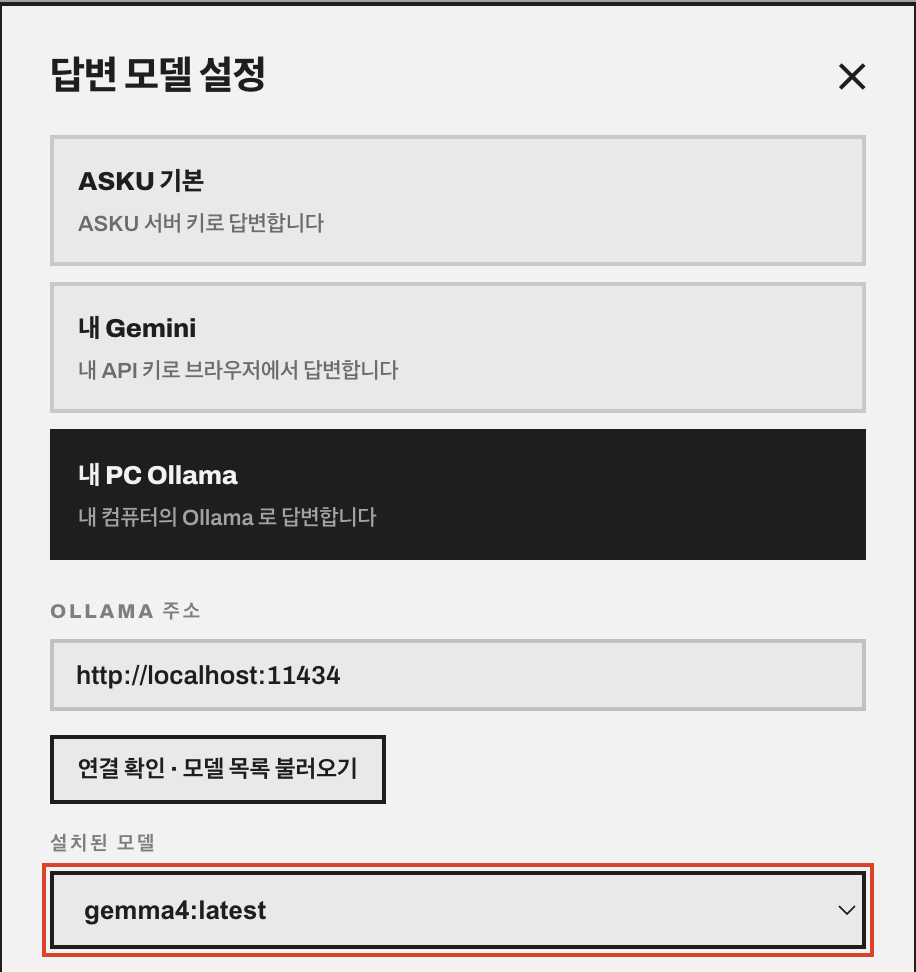

`LLMProvider` 인터페이스 하나로 OpenAI · Gemini · Ollama(로컬)를 같은 방식으로 다룬다. **추출 = API, 임베딩 = 로컬 bge-m3, 답변 = API 또는 내 PC의 Ollama** 처럼 단계별로 다르게 지정할 수 있고, 사용자가 UI에서 자기 API 키나 로컬 모델을 골라 쓸 수도 있다.

<br clear="all">

### 🛠️ 관리자 화면

HMAC 서명 토큰 기반 인증으로 학교 정보 수정·삭제, 첨부 삭제, 수동 재크롤링, 수집 상태 확인을 지원한다.

---

## 화면

디자인 원칙은 **모던 · 미니멀 · 타이포그래피 중심**. 색은 아끼고(빨강은 마크로만), 구조는 여백과 규칙선으로 보인다.

### 랜딩

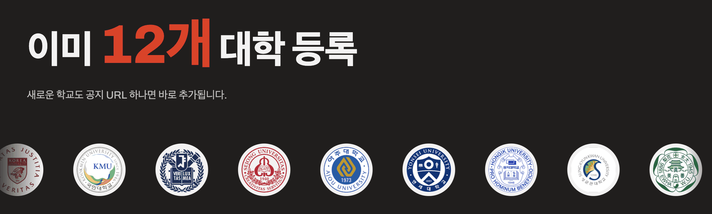

맨 위 배너가 랜딩 첫 화면이다. 아래로 스크롤하면 등록된 대학 로고가 마퀴로 흘러가 커버리지를 바로 보여준다.

### 학교 찾기

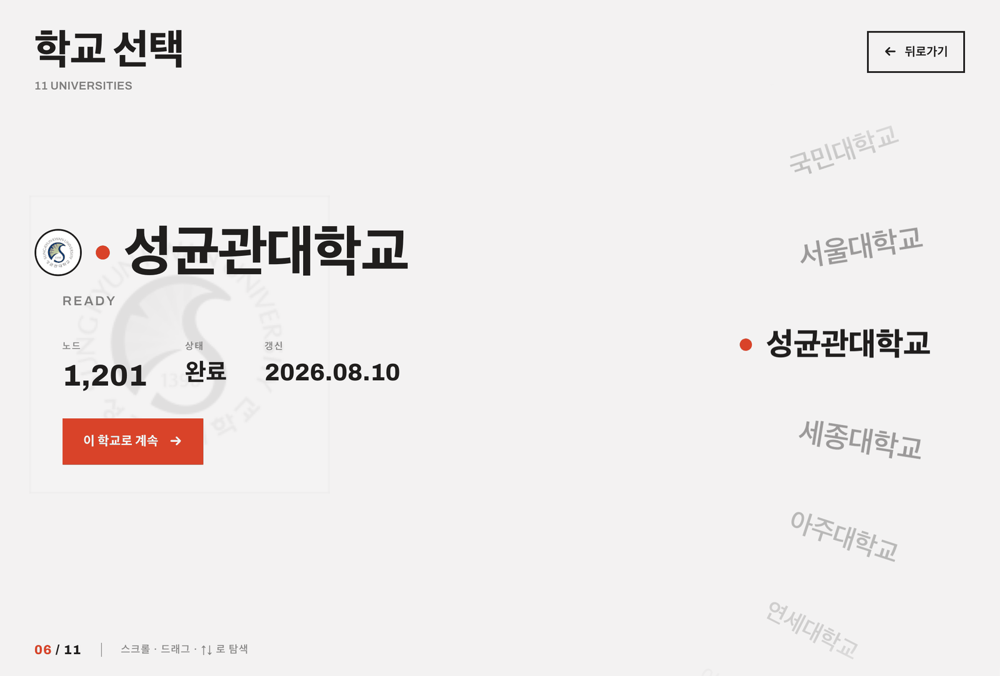

등록된 학교를 세로 휠로 고른다. 선택된 학교의 **노드 수 · 수집 상태 · 마지막 갱신일**이 카드에 함께 뜬다.

### 학교 등록 — 두 단계

<table>
<tr>
<td width="50%" valign="top">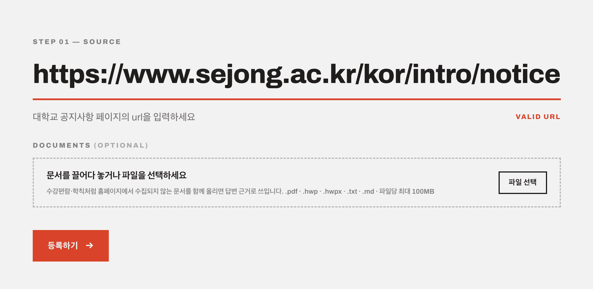</td>
<td width="50%" valign="top">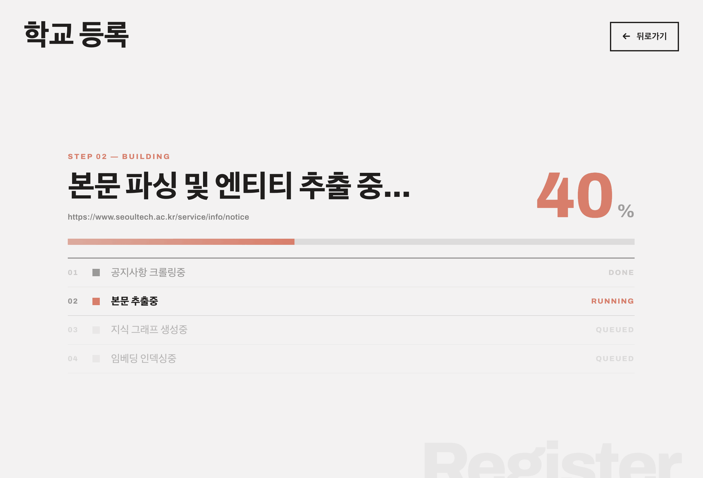</td>
</tr>
<tr>
<td valign="top"><b>STEP 01 · SOURCE</b> — 공지 URL을 넣으면 즉시 유효성을 검사한다. 수강편람·학칙처럼 홈페이지에서 수집되지 않는 문서는 여기서 함께 올린다.</td>
<td valign="top"><b>STEP 02 · BUILDING</b> — 크롤링 → 본문 추출 → 지식그래프 생성 → 임베딩 인덱싱 네 단계의 진행도를 실시간으로 보여준다.</td>
</tr>
</table>

### QA — 그래프 + 질문

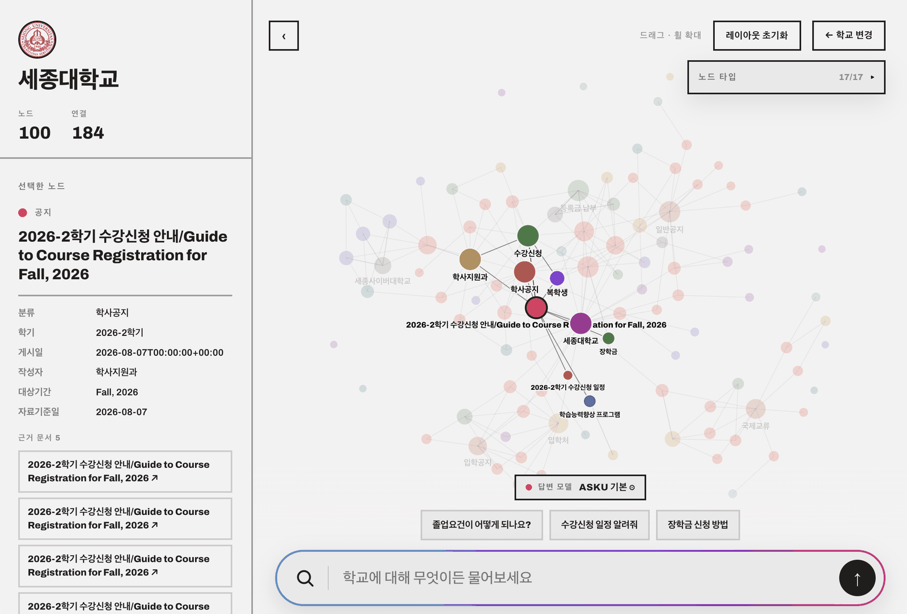

왼쪽 패널에 선택한 노드의 속성과 **근거 문서 목록**이, 가운데에 학교 지식그래프가, 아래에 질문바가 있다. 노드를 클릭하면 그 엔티티가 어느 공지에서 나왔는지 바로 추적된다.

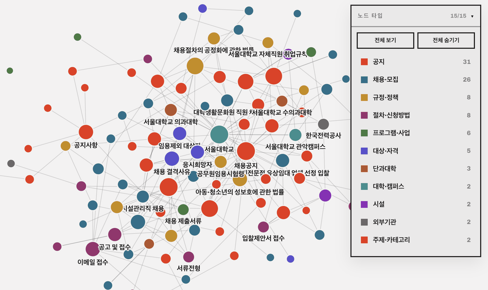

노드는 **타입별로 색이 다르고**(공지 · 채용·모집 · 규정·정책 · 절차·신청방법 · 대상·자격 · 시설 …), 오른쪽 패널에서 타입별 개수를 보며 켜고 끌 수 있다.

### 관리자

<div align="center">
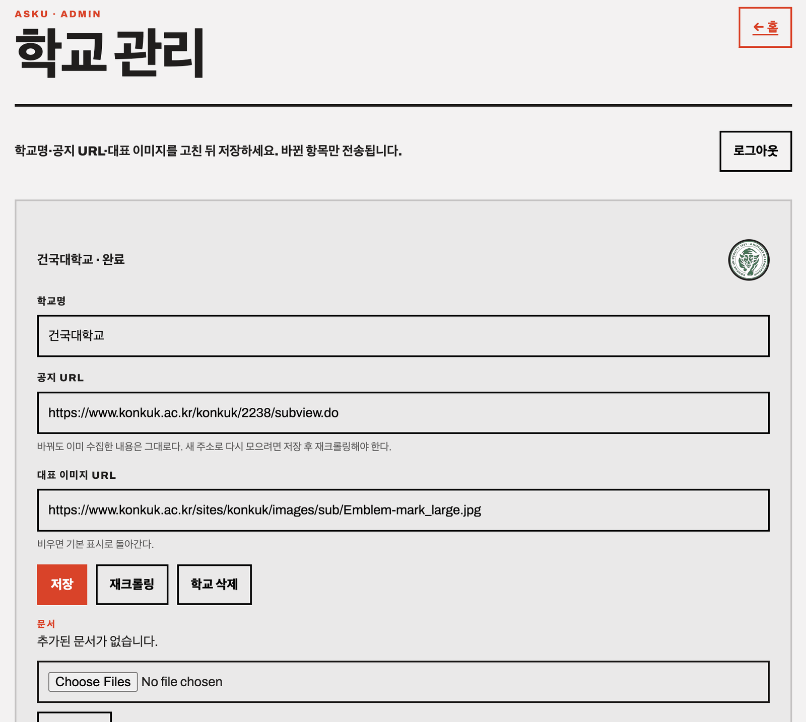
</div>

학교명·공지 URL·대표 이미지 수정, 재크롤링 트리거, 첨부 문서 관리, 학교 삭제. **바뀐 항목만** 전송한다.

---

## 아키텍처

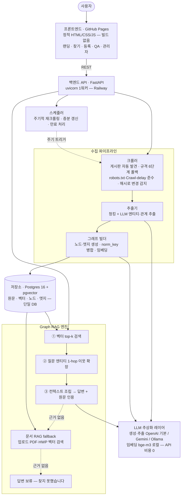

### 데이터 흐름

**등록** `학교명 + 공지 URL` → 게시판 자동 발견 → 목록·상세 순회 → 청킹 → LLM 엔티티·관계 추출 → 임베딩 → 노드·엣지 저장 → `ready`

**질의** `질문` → 임베딩 → 벡터 top-k(`source_type='web'`) → 질문 엔티티 추출 → `norm_key` 매칭 → 1-hop 이웃 확장 → 컨텍스트 조립 → 답변 생성 → 원문 링크 인용

### 기술 스택

| 영역 | 선택 | 이유 |
|---|---|---|
| 백엔드 | FastAPI + uvicorn(1워커) | 인프로세스 스케줄러·크롤 직렬화 전제 |
| 저장소 | Postgres 16 + pgvector | 그래프·벡터·원문 단일 DB 통합 |
| 크롤링 | requests + BeautifulSoup + protego | 정적 HTML 우선, robots.txt 정확 판정 |
| 임베딩 | bge-m3 (로컬, FlagEmbedding) | 한국어 강함 · API 비용 0 |
| 생성·추출 LLM | OpenAI(기본) / Gemini / Ollama | 인터페이스 하나로 교체 |
| 문서 파싱 | pdfplumber · olefile · zipfile | PDF · HWP 5.0 · HWPX |
| 프론트 | 순수 HTML/CSS/JS (빌드 없음) | 정적 배포로 운영 비용 0 |
| 배포 | Railway (api+db) · GitHub Pages (front) | 상시 가동 + 단일 컨테이너 |

---

## 실행 방법

### 1) Docker Compose (가장 빠름)

```bash
git clone https://github.com/linklingj/ASKU.git
cd ASKU
cp .env.example .env      # OPENAI_API_KEY 등 값 채우기
docker compose up -d --build
```

`http://localhost:8000/schools` 가 200을 주면 정상. 스키마와 pgvector 확장은 기동 시 자동 생성된다.

```bash
docker compose exec api python -m app.seed_schools   # 검증 완료 11개 학교 등록
curl -sX POST http://localhost:8000/schools/1/recrawl  # 수집 시작
curl -s     http://localhost:8000/schools/1/status     # crawling → indexing → ready
```

### 2) 로컬 개발

```bash
# 백엔드
python3 -m venv .venv && source .venv/bin/activate
pip install -r backend/requirements.txt
cp backend/.env.example backend/.env    # DATABASE_URL, OPENAI_API_KEY
uvicorn app.api:app --reload --app-dir backend

# 프론트엔드 (별도 터미널)
cd frontend/src && python3 -m http.server 5500
```

브라우저에서 `http://localhost:5500` 접속. API 주소는 `?api=http://localhost:8000` 쿼리스트링이나 `localStorage.asku_api`로 바꿀 수 있다.

### 3) 테스트

```bash
PYTHONPATH=backend python3 -m pytest backend/tests -q     # 323개
```

### 주요 환경 변수

| 키 | 기본값 | 설명 |
|---|---|---|
| `DATABASE_URL` | — | `postgresql+psycopg://…` 접두어 필수 |
| `LLM_PROVIDER` | `openai` | `openai` · `gemini` |
| `OPENAI_API_KEY` / `OPENAI_MODEL` | — / `gpt-5.6-luna` | 추출·답변 생성 |
| `SPEC_AUTOGEN` | 꺼짐 | 미지원 게시판 규격을 LLM으로 생성 (호출당 ~4만 토큰) |
| `MAX_GRAPH_NODES` | `1200` | 학교당 엔티티 상한 (메모리 안전장치) |
| `MAX_ATTACHMENT_MB` | `100` | 업로드 첨부 1건 크기 상한 |
| `ADMIN_PASSWORD` / `ADMIN_TOKEN_SECRET` | — | 관리자 기능. 비우면 관리자 엔드포인트가 닫힌다 |

전체 목록과 운영 주의사항: [`docs/02_FEATURES/deployment.md`](docs/02_FEATURES/deployment.md)

> ⚠️ 첫 질의는 느리다 — bge-m3(~2.3GB)를 그때 로드한다.

---

## 프로젝트 구조

```
ASKU/
├─ backend/
│  ├─ app/
│  │  ├─ api.py                REST 엔드포인트 (17개)
│  │  ├─ crawler.py            게시판 순회 · robots.txt 준수 · 변경 감지
│  │  ├─ board_discovery.py    하위 게시판 자동 발견
│  │  ├─ adapter_spec.py       수집 규격(어댑터) 정의·해석
│  │  ├─ spec_templates.py     알려진 게시판 제품 템플릿 (k2web · artclview …)
│  │  ├─ spec_generator.py     미지원 게시판 규격 LLM 자동 생성
│  │  ├─ html_digest.py        HTML → 본문 정제
│  │  ├─ extractor.py          청킹 + LLM 엔티티·관계 추출
│  │  ├─ graph_builder.py      노드·엣지 생성 · 중복 병합 · 임베딩
│  │  ├─ rag.py                GraphRAG · DocumentRAG · HybridRAG
│  │  ├─ attachment_ingest.py  PDF · HWP · HWPX 업로드 색인
│  │  ├─ scheduler.py          주기적 재크롤링 · 증분 갱신
│  │  ├─ llm.py                LLM 추상화 (OpenAI · Gemini · Ollama · bge-m3)
│  │  ├─ storage.py            Postgres + pgvector 접근 계층
│  │  ├─ models.py             영속 엔터티 (School · Document · Node · Edge)
│  │  ├─ schemas.py            파이프라인 계약 DTO
│  │  ├─ validation.py         수집 품질 검증
│  │  └─ seed_schools.py       검증 완료 학교 초기 등록
│  ├─ scripts/                 미리보기·검증 CLI (preview_* · check_schools …)
│  └─ tests/                   pytest 323개
│
├─ frontend/src/               정적 HTML/CSS/JS — 빌드 없음
│  ├─ index.html               랜딩
│  ├─ find.html                학교 찾기 (휠 선택)
│  ├─ register.html            학교 등록 + 문서 업로드
│  ├─ qa.html                  QA — 지식그래프 + 질문바
│  ├─ admin.html               관리자
│  ├─ api.js · model.js        API 클라이언트 · 상태 모델
│  └─ *.selfcheck.js           브라우저에서 도는 자체 검증
│
├─ docs/
│  ├─ 00_BASICS/               PLAN · 코드 컨벤션 · Git 컨벤션
│  ├─ 01_SYSTEM/               시스템 단위 설계 10편
│  └─ 02_FEATURES/             기능별 개발 문서 8편
│
├─ docker-compose.yml          로컬 개발용 (api + db)
└─ .github/workflows/pages.yml 프론트 자동 배포
```

---

## 기술적 도전과 해결

<details>
<summary><b>1. 학교마다 다른 게시판 구조 — 파서를 어떻게 일반화할 것인가</b></summary>

<br>

**문제**: 대학마다 게시판 제품이 다르고, 같은 제품도 커스터마이징이 제각각이다. 학교마다 파서를 짜면 확장이 불가능하다.

**해결**: 파싱 로직 대신 **선언적 수집 규격(spec)** 을 도입하고, 6단계 폴백 체인으로 규격을 결정한다.

```
전용 어댑터 클래스 → 저장된 규격 → 학교별 규격 → 알려진 템플릿 → (설정 시) LLM 생성 → 공용 파서
```

**결과**: 아주대·이화여대·건국대가 **코드 추가 0줄**로 붙었다. 새 학교가 깨질 때마다 학교용 코드가 아니라 규격 필드를 늘리는 방향으로 고쳤다 — 상세 링크가 JavaScript에만 있는 고려대·경희대는 `detail_link_attr`·`detail_link_pattern`·`detail_link_template` 세 필드를 추가해 해결했고, 이후 같은 유형의 학교는 설정 한 장이면 된다.

</details>


<details>
<summary><b>2. HTML 정제가 본문을 지워버리는 문제</b></summary>

<br>

**문제**: 잡음 제거 로직이 `<form>`·`<input>`을 통째로 삭제했는데, 사이트가 닫는 태그를 흘리면 html.parser가 뒤따르는 게시글 본문을 `<input>` **안쪽**에 넣어버려 본문까지 사라졌다. 서울대는 글 제목이 `<header>` 안에 있어 잡음 제거에 먼저 지워졌다.

**해결**: 다른 요소를 품고 있는 태그는 **껍데기만 벗겨 내도록** 바꿨다. 개별 학교 대응이 아니라 파서의 일반 결함으로 고쳐, 모든 학교가 함께 이득을 봤다.

</details>

<details>
<summary><b>3. 환각 막기</b></summary>

<br>

**문제**: RAG 답변은 근거가 약할 때 그럴듯한 거짓을 만든다.

**해결**: 세 겹으로 막았다.
1. 모든 노드·엣지가 `source_doc_ids`로 원문과 연결 — 답변에 원문 링크 강제 인용.
2. 유사도 임계값(0.6) 미만이면 그 단계는 **보류**(`source_type = null`).
3. 그래프·문서 두 단계가 모두 보류하면 **"찾지 못했습니다"** 를 반환. 지어내지 않는다.

</details>

<details>
<summary><b>4. 메모리 4GB 안에서 돌리기</b></summary>

<br>

**문제**: 로컬 bge-m3가 상주 3~4GB를 쓴다. 크롤이 동시에 돌면 임베더가 그 수만큼 겹쳐 떠 OOM이 난다.

**해결**: 프로세스 전역 락으로 크롤을 직렬화하고, 워커를 1개로 고정했다(인프로세스 스케줄러의 중복 실행 방지도 겸한다). `MAX_GRAPH_NODES`·`MAX_ATTACHMENT_MB`·`MAX_ATTACHMENT_CHUNKS` 세 상한을 환경변수로 열어 재배포 없이 조정 가능하게 했다.

</details>

---

## 문서

코드를 짜기 전에 해당 문서를 읽고, 인터페이스가 바뀌면 같은 커밋에서 문서도 갱신하는 것을 원칙으로 했다.

| 문서 | 내용 |
|---|---|
| [`00_BASICS/PLAN.md`](docs/00_BASICS/PLAN.md) | 전체 기획 · 아키텍처 · 로드맵 |
| [`00_BASICS/code-convention.md`](docs/00_BASICS/code-convention.md) | 코드·문서화·협업 규칙 |
| [`00_BASICS/git-convention.md`](docs/00_BASICS/git-convention.md) | Gitflow · Conventional Commits · PR 템플릿 |
| [`01_SYSTEM/`](docs/01_SYSTEM) | 시스템 단위 설계 10편 (API · 프론트 · 크롤러 · 추출기 · 그래프 빌더 · 저장소 · RAG · LLM · 스케줄러 · 데이터 모델) |
| [`02_FEATURES/`](docs/02_FEATURES) | 기능별 개발 문서 8편 |
| [`02_FEATURES/school-support-status.md`](docs/02_FEATURES/school-support-status.md) | 학교별 수집 현황과 남은 작업 |
| [`02_FEATURES/deployment.md`](docs/02_FEATURES/deployment.md) | Railway · GitHub Pages 배포 절차 |

---

## 팀

<div align="center">

<!-- 이미지 자리: 팀 사진 또는 프로필 이미지 -->

| 이름 | 역할 | GitHub |
|:---:|:---|:---:|
| **최재현** | 그래프 RAG · 프론트엔드 · 배포 | [@linklingj](https://github.com/linklingj) |
| **권시헌** | 크롤러 수집 규격 · 학교 지원 · LLM 제공자 | [@ksihun](https://github.com/ksihun) |
| **김건민** | 문서 RAG · 백엔드 API QA · 답변 렌더링 | [@3lynk](https://github.com/3lynk) |

</div>

### 협업 규칙

- **브랜치**: Gitflow — `main` ← `develop` ← `feature/*`. PR은 항상 `develop` 대상.
- **커밋**: Conventional Commits (`feat:` · `fix:` · `docs:` · `refactor:` · `test:` · `chore:`).
- **문서**: 기능 개발은 `02_FEATURES/`, 구조 변경은 `01_SYSTEM/`에 반영.

---

<div align="center">

**ASKU** · 2026 콘텐츠 소프트웨어학과 학술제 출품작

[🌐 서비스](https://linklingj.github.io/ASKU/) · [📖 기획 문서](docs/00_BASICS/PLAN.md) · [🐙 GitHub](https://github.com/linklingj/ASKU)

</div>
